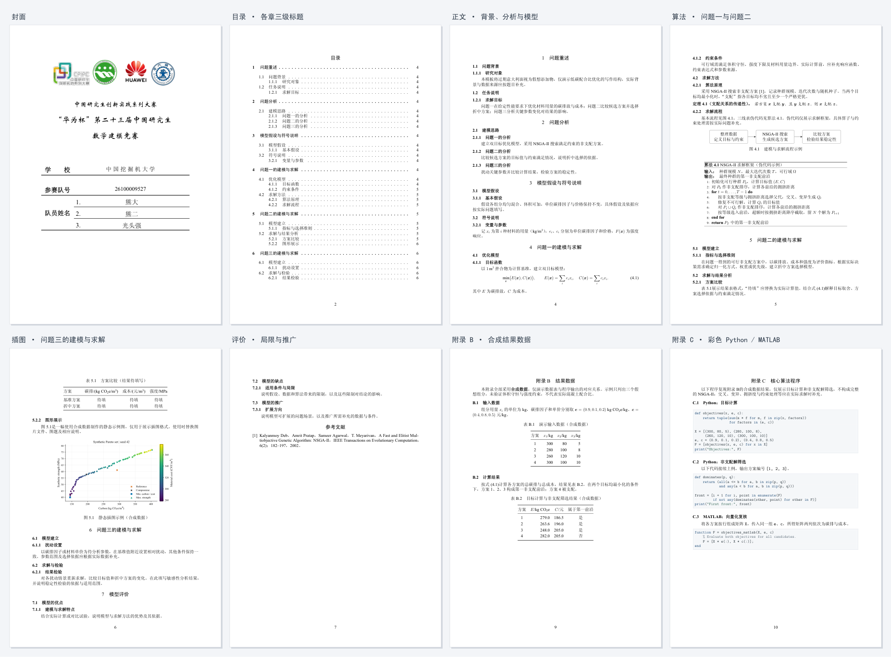

<div align="center">

# 🏆 GMCM2026 LaTeX Template

2026「华为杯」第二十三届中国研究生数学建模竞赛论文模板

[完整 PDF](docs/preview.pdf) · [下载源码](https://github.com/rudykon/GMCM2026-LaTeX-Template/archive/refs/heads/main.zip) · [格式说明](docs/FORMAT.md)

[](docs/preview.pdf)

</div>

## 模板特点

- 依据当届附件 2、3 设置封面、字体、标题和页码。
- 提供三级目录、公式、定理、三线表算法伪代码、流程图、插图与参考文献示例。
- 附录含图表目录、合成结果数据与彩色代码，以 Python 为主，辅以 MATLAB。
- 当前预览共 **11 页**，内容简短，便于直接替换。

## 🚀 快速开始

准备支持中文的 TeX 环境（如 TeX Live、MacTeX 或 MiKTeX），使用 **XeLaTeX + latexmk**。

1. 下载并解压源码，按下表填写参赛信息、替换示例内容。
2. 在项目根目录编译：

```bash
latexmk main.tex       # 带封面，生成 main.pdf
latexmk anonymous.tex  # 省略封面，生成 anonymous.pdf
```

**Overleaf：**上传源码 ZIP，选择 XeLaTeX，主文件设为 `main.tex`。
本地也可使用 `bash build.sh` 或 `build.bat`；追加 `clean` 清理辅助文件并保留 PDF。

## 修改位置

| 内容 | 文件 |
| --- | --- |
| 题目、学校、队号与队员 | [config.tex](config.tex) |
| 摘要、正文与附录 | [sections/](sections/) |
| 图片与流程图 | [figures/](figures/) |
| 参考文献 | [reference.bib](reference.bib) |

正文分为七章：问题重述、问题分析、模型假设与符号说明、问题一至三的建模与求解、模型评价；各章均提供二、三级标题示例，并自动进入目录。

示例图使用合成数据，仅展示排版。替换图片时同步修改图题和正文引用，见[插图说明](figures/README.md)。

## 缺少字体

字体文件单独放在 [Overleaf 字体补充包](https://github.com/rudykon/GMCM2026-LaTeX-Template/releases/download/overleaf-fonts-20260917/GMCM2026-Overleaf-Fonts.zip)中。解压后将 `fonts/` 和 `config.local.tex` 上传到项目根目录，选择 XeLaTeX 并从头重新编译；已有同名配置时合并字体设置。

缺少宋体、黑体或 Times New Roman 时，模板会自动使用免费替代字体。TeX Live / MacTeX / TinyTeX 可安装：

```bash
tlmgr install fandol tex-gyre
```

也可直接下载 [Fandol 中文字体](https://mirrors.ctan.org/fonts/fandol.zip)和 [TeX Gyre 西文字体](https://mirrors.ctan.org/fonts/tex-gyre.zip)；MiKTeX 用户在 Console 中安装同名包。

要使用预览中的宋体、黑体、华文新魏、隶书和 Times New Roman，见[原字体获取、系统安装与 Overleaf 配置](docs/FORMAT.md#字体下载与安装)。免费替代字体的字形与预览有差异。

## 常用说明

正式稿使用 `main.tex`；封面不编号，摘要从第 1 页开始，摘要后自动生成目录，后续页码连续。若不需要目录，在文档类选项中加入 `notoc`。`anonymous.tex` 仅省略封面，用于内部审阅。

参赛信息也可写入被 Git 忽略的 `config.local.tex`。导入 Word 封面见[封面说明](docs/official/README.md)，版式细节见[格式说明](docs/FORMAT.md)。

## 许可与致谢

代码采用 [MIT License](LICENSE)；字体、官方附件与 Logo 等遵循各自许可。参考项目及实现来源见[来源与致谢](docs/FORMAT.md#实现来源与许可)。
